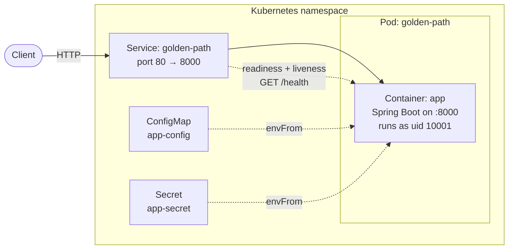
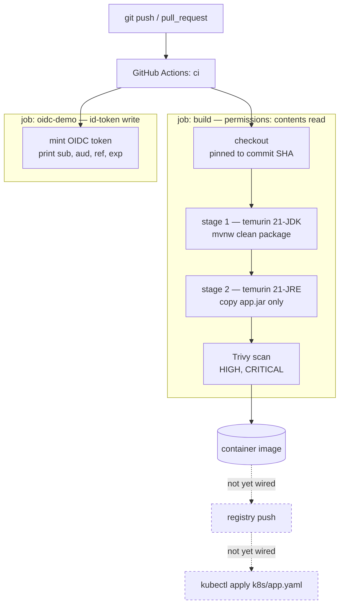

# golden-path-starter

A reference implementation of a **golden path**: the smallest possible Spring Boot service, wrapped in the build, container, scan, and deploy practices a platform team wants every service to inherit by default.

The application itself is deliberately trivial — two endpoints, no database, no state. The value of this repo is everything *around* the application: the multi-stage container build, the vulnerability gate, the keyless CI identity, and the Kubernetes manifest. It is meant to be read, copied, and used as the starting template for real services.

The repo also keeps the "before" alongside the "after" — [`Dockerfile.bad`](Dockerfile.bad) and [`scan-before.txt`](scan-before.txt) exist so the improvements are demonstrable rather than asserted.

---

## Table of contents

- [Architecture](#architecture)
- [Application](#application)
- [Technology stack](#technology-stack)
- [Repository layout](#repository-layout)
- [Running it](#running-it)
- [Container build](#container-build)
- [CI/CD pipeline](#cicd-pipeline)
- [Kubernetes deployment](#kubernetes-deployment)
- [Security posture](#security-posture)
- [Known gaps](#known-gaps)

---

## Architecture

### Runtime

The service is a single stateless process. There is no database, cache, or downstream dependency — a request is served entirely from within the JVM.



Configuration reaches the container as environment variables via `envFrom`, so nothing is baked into the image. `kubelet` polls `/health` for both readiness and liveness, which is why that endpoint has no dependencies — it must stay fast and must not fail for reasons outside the process.

### Build and supply chain

The path from a commit to a running pod, and where each control sits:



Two deliberate properties of this graph:

- **The compiler never ships.** Maven and the JDK exist only in stage 1. The image that reaches production contains a JRE and one jar, which removes a large amount of attack surface and tooling an attacker could reuse.
- **Every external input is pinned by digest.** Base images and GitHub Actions are referenced by SHA, not by tag, so `v4.2.2` or `21-jre` being re-pointed upstream cannot silently change what gets built.

The dashed edges are not implemented. See [Known gaps](#known-gaps).

---

## Application

A Spring Boot REST service listening on **port 8000** ([`application.properties`](src/main/resources/application.properties)).

| Method | Path | Response | Purpose |
| --- | --- | --- | --- |
| `GET` | `/health` | `{"status":"ok"}` | Liveness and readiness probe target |
| `GET` | `/items` | `[{"id":1,"name":"hello"}]` | Placeholder domain endpoint |

Two classes, both in `com.example.goldenpath`:

- [`GoldenPathApplication.java`](src/main/java/com/example/goldenpath/GoldenPathApplication.java) — `@SpringBootApplication` entry point.
- [`ApiController.java`](src/main/java/com/example/goldenpath/ApiController.java) — `@RestController` holding both endpoints.

`/items` returns a hardcoded list. It is the seam where real logic goes — replace it with a service and repository, and the rest of the repo keeps working unchanged.

---

## Technology stack

| Layer | Choice | Notes |
| --- | --- | --- |
| Language | Java 21 | LTS |
| Framework | Spring Boot 4.1.0 | `spring-boot-starter-webmvc` |
| Build | Maven via `./mvnw` | Wrapper committed, so no local Maven needed |
| Test | JUnit 5 + `spring-boot-starter-webmvc-test` | Currently context-load only |
| Runtime image | `eclipse-temurin:21-jre` | Digest-pinned |
| Scanner | Trivy (`trivy-action` v0.36.0) | HIGH and CRITICAL |
| CI | GitHub Actions | [`ci.yml`](.github/workflows/ci.yml) |
| Orchestration | Kubernetes | [`k8s/app.yaml`](k8s/app.yaml) |

---

## Repository layout

```
.
├── src/main/java/com/example/goldenpath/
│   ├── GoldenPathApplication.java   entry point
│   └── ApiController.java           /health and /items
├── src/main/resources/
│   └── application.properties       app name, server.port=8000
├── src/test/java/…/GoldenPathApplicationTests.java
├── Dockerfile                       multi-stage, non-root, digest-pinned
├── Dockerfile.bad                   the anti-pattern, kept for contrast
├── k8s/app.yaml                     ConfigMap, Secret, Deployment, Service
├── .github/workflows/ci.yml         build → scan, plus OIDC demo
├── scan-before.txt                  Trivy output for the bad image
├── scan-after.txt                   Trivy output for the hardened image
└── pom.xml
```

---

## Running it

### Locally

```bash
./mvnw spring-boot:run
curl localhost:8000/health
curl localhost:8000/items
```

### Tests

```bash
./mvnw test
```

### As a container

```bash
docker build -t golden-path:v1 .
docker run --rm -p 8000:8000 golden-path:v1
curl localhost:8000/health
```

### On Kubernetes

```bash
kubectl apply -f k8s/app.yaml
kubectl port-forward svc/golden-path 8080:80
curl localhost:8080/health
```

The manifest sets `imagePullPolicy: IfNotPresent` and references `golden-path:v1` with no registry prefix, so it expects a locally built image — suited to kind, minikube, or Docker Desktop. Pointing it at a real cluster means pushing to a registry and using the fully qualified image reference.

---

## Container build

[`Dockerfile`](Dockerfile) against [`Dockerfile.bad`](Dockerfile.bad) is the clearest illustration of what this repo is arguing for:

| | `Dockerfile.bad` | `Dockerfile` |
| --- | --- | --- |
| Stages | One — the build toolchain ships to production | Two — only the jar crosses the boundary |
| Base | Full JDK | JRE, no compiler |
| Tag pinning | Floating `:21-jdk` | Pinned by `sha256:` digest |
| User | `root` | `app`, uid 10001 |
| Copied in | The entire build context, `.git` and all | One jar from the builder stage |
| Entry | `CMD` with a version-specific jar path | `ENTRYPOINT` on a stable `app.jar` |

The `COPY . .` in the bad version is the quietly dangerous line: it drags the full working tree — history, local config, any stray credential — into a published image layer, where deleting it later does not remove it.

Running as uid 10001 rather than root is what makes the container compatible with a restrictive `PodSecurityContext`, and it means a process escape does not start with root in the container's namespace.

---

## CI/CD pipeline

Defined in [`ci.yml`](.github/workflows/ci.yml), triggered on every push and pull request. Top-level permissions are `contents: read`, so jobs are read-only unless they opt into more.

### `build`

1. `actions/checkout`, pinned to a commit SHA.
2. `docker build -t golden-path:ci .` — proves the multi-stage build works on a clean machine.
3. Trivy scan of the built image at HIGH and CRITICAL.

### `oidc-demo`

This job requests `id-token: write`, mints a GitHub OIDC token, and prints its claims — `sub`, `aud`, `repository`, `ref`, `iat`, `exp` — along with the token's lifetime.

It deploys nothing. It exists because the `sub` claim is the exact string a cloud trust policy matches on:

```
repo:sharsha2/golden-path-starter:ref:refs/heads/main
```

Run it once, read that value, and you can write an AWS `AssumeRoleWithWebIdentity` condition, a GCP Workload Identity Federation binding, or an Azure federated credential without guessing. That unlocks pushing images, deploying manifests, pulling real secrets, and keyless image signing — all with a token that expires in minutes, instead of a long-lived cloud key sitting in repository secrets where any workflow can read it and no one rotates it.

It is scaffolding. Once a real deploy step exists, this job should be replaced by it or deleted.

---

## Kubernetes deployment

[`k8s/app.yaml`](k8s/app.yaml) contains four objects:

| Kind | Name | Role |
| --- | --- | --- |
| ConfigMap | `app-config` | `APP_ENV=dev`, injected via `envFrom` |
| Secret | `app-secret` | `API_TOKEN`, placeholder value |
| Deployment | `golden-path` | 1 replica, both probes on `/health` |
| Service | `golden-path` | ClusterIP, port 80 → container 8000 |

Readiness gates traffic — the pod receives no requests until `/health` answers, so a rollout cannot send traffic to a JVM that is still starting. Liveness restarts a wedged process. They use the same endpoint but answer different questions, which is why the initial delays differ (3s and 10s).

The `Secret` is a stub. `API_TOKEN: "fake-value-for-now"` is committed with a comment stating it must never hold a real value, because a Kubernetes `Secret` is base64, not encryption, and this file is in git. Real values belong in a secret manager, fetched at deploy time by the OIDC-authenticated pipeline described above.

---

## Security posture

What this repo already does:

- **No build tooling in the runtime image** — no compiler, no Maven, no source.
- **Non-root execution** — uid 10001, created explicitly rather than relying on a base image default.
- **Digest-pinned base images and Actions** — upstream tag movement cannot alter a build.
- **Least-privilege workflow permissions** — `contents: read` at the top, elevated per job only where needed.
- **Vulnerability scanning in CI** — Trivy on every push and PR.
- **Keyless cloud identity** — OIDC federation instead of stored long-lived credentials.
- **No secrets in the image or repository** — the one committed secret is an explicit placeholder.

Measured effect, from [`scan-before.txt`](scan-before.txt) versus [`scan-after.txt`](scan-after.txt): the bad image surfaces the entire Maven dependency cache under `/root/.m2` as scannable content, hundreds of jars that have no business being in a runtime image. The hardened image reduces that to `app/app.jar` plus the base OS.

---

## Known gaps

Stated plainly, since a golden path that hides its own unfinished edges is not much of a guide.

1. **The Trivy step reports but does not gate.** `trivy-action` defaults to `exit-code: 0`, so findings are printed and the job still passes. Add `exit-code: 1` to make the scan an actual gate.
2. **Eight HIGH CVEs remain in the hardened image.** They are in `usr/bin/pebble` (Go stdlib) from the Temurin base layer, not in application code — see [`scan-after.txt`](scan-after.txt). Fixing them means moving to a newer or more minimal base image. This is exactly the case gap 1 would catch.
3. **No push and no deploy.** CI builds and scans, then discards the image. Registry push and `kubectl apply` are the next steps, and are what the OIDC job is preparing for.
4. **Tests are a placeholder.** `contextLoads()` proves Spring starts and nothing more. Neither endpoint has a test.
5. **No resource requests or limits** on the Deployment, so the pod is `BestEffort` QoS and is evicted first under node pressure.
6. **No pod-level `securityContext`.** The image runs as non-root, but the manifest does not enforce `runAsNonRoot`, `readOnlyRootFilesystem`, or dropped capabilities.
7. **Single replica, no `PodDisruptionBudget`,** so any rollout or node drain is a full outage.
8. **No image signing or SBOM.** Nothing proves a given image came from this pipeline. Cosign keyless signing would reuse the same OIDC identity already demonstrated here.
